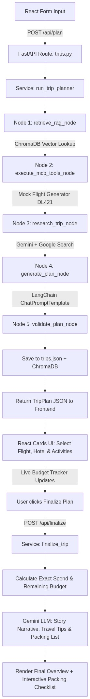

# Tripster AI — Complete Project Flow & Code Guide

This guide explains every file in the project, what each one does, the exact code inside it, and how they all connect. Read it top-to-bottom to understand the full flow from browser to saved plan.

---

## Table of Contents
1. [What the Project Does](#1-what-the-project-does)
2. [LangGraph Agent Execution Flowchart](#2-langgraph-agent-execution-flowchart)
3. [Directory Map](#3-directory-map)
4. [Environment & Startup](#4-environment--startup)
5. [Complete Request Flow (Diagrams)](#5-complete-request-flow-diagrams)
6. [Frontend — React App](#6-frontend--react-app)
7. [Backend Entrypoint — main.py](#7-backend-entrypoint--mainpy)
8. [Configuration — config.py](#8-configuration--configpy)
9. [API Routes — trips.py & health.py](#9-api-routes--tripspy--healthpy)
10. [Schemas — trip.py](#10-schemas--trippy)
11. [Service Layer — trip_service.py](#11-service-layer--trip_servicepy)
12. [LangGraph Agent — graph.py & state.py](#12-langgraph-agent--graphpy--statepy)
13. [Agent Nodes — nodes.py](#13-agent-nodes--nodespy)
14. [Gemini LLM Setup — llm.py](#14-gemini-llm-setup--llmpy)
15. [Flight Tool — travel_server.py](#15-flight-tool--travel_serverpy)
16. [RAG System — retriever.py & ingestion.py](#16-rag-system--retrieverpy--ingestionpy)
17. [Vector Database — vector_store.py](#17-vector-database--vector_storepy)
18. [File Database — database.py & trip_repository.py](#18-file-database--databasepy--trip_repositorypy)
19. [Running the Project](#19-running-the-project)
20. [Troubleshooting](#20-troubleshooting)

---

## 1. What the Project Does

Tripster is a full-stack AI travel planner. You fill out a form (destination, dates, budget, etc.) and the system:
1. Searches ChromaDB for any destination knowledge you've added and similar past trips.
2. Generates realistic mock flight options.
3. Uses Gemini AI with Google Search to research current hotels, activities, and weather.
4. Assembles a complete trip plan with flights, hotels, and day-by-day activity cards.
5. Lets you **select** your preferred flight, hotel, and activities — with a live budget tracker.
6. Sends your selections back to Gemini AI which writes a narrative summary, travel tips, and a custom packing checklist.

---

## 2. LangGraph Agent Execution Flowchart

Below is the automatically generated flowchart of the full end-to-end architecture, including both the React frontend and the LangGraph pipeline:



---

## 3. Directory Map

```text
Tripster2/
│
├── backend/                        ← Python FastAPI server
│   ├── requirements.txt            ← Python packages needed
│   └── app/
│       ├── main.py                 ← Creates the FastAPI app, registers routes
│       ├── core/
│       │   └── config.py           ← Loads .env and defines all file paths
│       ├── api/routes/
│       │   ├── health.py           ← GET /health (simple status check)
│       │   └── trips.py            ← POST /api/plan, POST /api/finalize, GET /api/trips
│       ├── schemas/
│       │   └── trip.py             ← All Pydantic data models (what data looks like)
│       ├── services/
│       │   └── trip_service.py     ← Coordinates planning and finalization logic
│       ├── agent/
│       │   ├── state.py            ← The shared data "bag" passed between AI steps
│       │   ├── graph.py            ← Builds the LangGraph pipeline and runs it
│       │   ├── nodes.py            ← The 5 AI pipeline steps (RAG, flights, research, plan, validate)
│       │   └── llm.py              ← Sets up the 2 Gemini AI models
│       ├── rag/
│       │   ├── ingestion.py        ← Reads .txt files and stores them in ChromaDB
│       │   └── retriever.py        ← Fetches matching context from ChromaDB
│       └── data/
│           ├── database.py         ← Reads/writes trips.json and mcp_cache.json files
│           ├── vector_store.py     ← Manages ChromaDB (travel guides + trip history)
│           └── repositories/
│               └── trip_repository.py  ← Saves/loads TripPlan objects
│
├── frontend/                       ← React web app
│   ├── package.json
│   ├── public/index.html           ← The HTML shell (just has <div id="root">)
│   └── src/
│       ├── index.js                ← Mounts React into the HTML <div id="root">
│       ├── App.jsx                 ← The entire UI: form, cards, budget tracker, packing list
│       └── index.css               ← Dark theme styling and layout
│
├── mcp_servers/
│   └── travel_server.py            ← Generates mock flight options
│
├── data/                           ← Auto-created at runtime
│   ├── documents/                  ← Put your .txt travel guides here for RAG
│   ├── chroma/                     ← ChromaDB stores its vector data here
│   ├── trips.json                  ← All saved trip plans go here
│   └── mcp_cache.json              ← Caches flight results for 1 hour
│
├── .env                            ← Your secret API keys (never commit this!)
└── .env.example                    ← Template showing what keys are needed
```

---

## 4. Environment & Startup

### `.env` file
Create this in the project root. Never share or commit it:
```env
GEMINI_API_KEY=your-key-here
GEMINI_MODEL=gemini-2.5-flash
LANGCHAIN_TRACING_V2=false
LANGCHAIN_API_KEY=
LANGCHAIN_PROJECT=Tripster
```

### `requirements.txt`
The Python packages the backend needs:
```text
fastapi              ← the web framework
uvicorn              ← runs the web server
pydantic             ← data validation models
python-dotenv        ← reads .env files
langchain            ← the LLM toolkit
langgraph            ← builds the AI pipeline graph
langchain-google-genai ← Gemini AI connector
chromadb             ← local vector database
mcp                  ← Model Context Protocol (used by travel_server.py)
httpx                ← HTTP client (used by travel_server.py)
```

---

## 5. Complete Request Flow (Diagrams)

### Phase 1 — Planning (`POST /api/plan`)

```text
User fills form in browser 
  --> React sends POST /api/plan
    --> FastAPI: trips.py validates the request
      --> trip_service.create_trip()
        --> graph.py: run_trip_planner()
          --> Node 1: retrieve_rag_node (ChromaDB travel guides & history)
          --> Node 2: execute_mcp_tools_node (Mock flight generation & caching)
          --> Node 3: research_trip_node (Gemini AI + Google Search)
          --> Node 4: generate_plan_node (LangChain ChatPromptTemplate)
          --> Node 5: validate_plan_node (Check day counts)
        --> trip_repository.save_trip_plan() (Save to trips.json & ChromaDB)
    --> Return TripPlan JSON to React
```

### Phase 2 — Finalization (`POST /api/finalize`)

```text
User selects flight, hotel, activities (Budget tracker updates live)
  --> User clicks "Generate Final Plan with AI"
    --> React sends POST /api/finalize
      --> trip_service.finalize_trip()
        --> Calculate exact spend and budget remaining
        --> Gemini LLM creates Narrative, Travel Tips & Packing Checklist
    --> Return FinalizedPlan to React
```

---

## 6. Frontend — React App

### `public/index.html`
This is just the browser shell. React loads into the `<div id="root">` tag.

### `src/index.js`
The 3-line entrypoint. All it does is mount `App.jsx` into the HTML:
```javascript
import React from 'react';
import ReactDOM from 'react-dom/client';
import './index.css';
import App from './App';

const root = ReactDOM.createRoot(document.getElementById('root'));
root.render(<App />);
```

### `src/App.jsx`
This is the entire UI in one file. Here is how it is structured:

**State Variables:**
```javascript
const [form, setForm] = useState(initialForm);       // form input values
const [tripPlan, setTripPlan] = useState(null);      // plan returned by /api/plan
const [selectedFlight, setSelectedFlight] = useState(null);  // index of chosen flight
const [selectedHotel, setSelectedHotel] = useState(null);    // index of chosen hotel
const [selectedActivities, setSelectedActivities] = useState({});  // {dayIndex: [actIdx, ...]}
const [finalizedPlan, setFinalizedPlan] = useState(null);    // returned by /api/finalize
```

**Live Budget Calculator (runs every time a selection changes):**
```javascript
const budgetTotals = useMemo(() => {
    const flightCost = selectedFlight !== null ? tripPlan.flights[selectedFlight].price : 0;
    const hotelCost = selectedHotel !== null
        ? tripPlan.hotels[selectedHotel].price_per_night * tripPlan.duration_days : 0;
    const activityCost = // sum of all selected activity costs
    return { flightCost, hotelCost, activityCost, totalSpent, remaining };
}, [tripPlan, selectedFlight, selectedHotel, selectedActivities]);
```

**Activity Image Helper (fetches relevant photo from reliable service):**
```javascript
function activityImageUrl(destination, title) {
    const query = encodeURIComponent(`${destination},travel`).toLowerCase();
    const seed = (destination + title).split('').reduce((acc, char) => acc + char.charCodeAt(0), 0);
    return `https://loremflickr.com/400/220/${query}?random=${seed}`;
}
```

---

## 7. Backend Entrypoint — `main.py`

```python
from fastapi import FastAPI
from fastapi.middleware.cors import CORSMiddleware
from app.api.routes import health, trips
from app.core.config import settings

app = FastAPI(title=settings.PROJECT_NAME, version=settings.VERSION)

# Allow the React app on port 3000 to call this server on port 8000
app.add_middleware(CORSMiddleware, allow_origins=["*"], allow_methods=["*"], allow_headers=["*"])

# Register the two route files
app.include_router(health.router)  # GET /health
app.include_router(trips.router)   # POST /api/plan, POST /api/finalize, GET /api/trips
```

This file deliberately has no logic. It only wires pieces together.

---

## 8. Configuration — `config.py`

```python
import os
from dotenv import load_dotenv

load_dotenv()  # reads the .env file

class Settings:
    GEMINI_API_KEY = os.getenv("GEMINI_API_KEY", "")

    # File paths. config.py is 4 directories deep inside backend/,
    # so walking up 4 parents lands us at the project root (Tripster2/).
    ROOT_DIR = os.path.dirname(os.path.dirname(os.path.dirname(os.path.dirname(os.path.abspath(__file__)))))
    DATA_DIR = os.path.join(ROOT_DIR, "data")
    CHROMA_DIR = os.path.join(DATA_DIR, "chroma")
    DB_FILE = os.path.join(DATA_DIR, "trips.json")
    MCP_CACHE_FILE = os.path.join(DATA_DIR, "mcp_cache.json")
    MCP_CACHE_TTL_SECONDS = 3600  # 1 hour

settings = Settings()
```

---

## 9. API Routes — `trips.py` & `health.py`

### `health.py` — Simple status check
```python
@router.get("/health")
def health():
    return {"status": "healthy"}
```

### `trips.py` — Three endpoints
```python
@router.post("/api/plan")
def plan_trip(preferences: TripPreferences):
    # FastAPI auto-validates the JSON body against TripPreferences schema
    trip_plan = trip_service.create_trip(preferences)
    return {"success": True, "trip_plan": trip_plan.model_dump()}

@router.post("/api/finalize")
def finalize_trip(request: FinalizeRequest):
    # Takes user's selections, returns LLM-written final plan
    result = trip_service.finalize_trip(request)
    return {"success": True, "finalized_plan": result.model_dump()}
```

---

## 10. Schemas — `trip.py`

Pydantic models define the shape of all data. FastAPI uses these for automatic validation.

```python
# What the browser sends to /api/plan
class TripPreferences(BaseModel):
    destination: str             
    origin: str = "New York"
    budget: float = 2000.0
    currency: str = "USD"
    start_date: str              
    end_date: str                
    interests: List[str]         
    travel_style: str = "balanced"  

# A single flight option
class FlightOption(BaseModel):
    airline: str
    flight_number: str
    origin: str
    destination: str
    price: float
    duration: str   
    departure: str
    arrival: str
    is_direct: bool

# A single hotel option
class HotelOption(BaseModel):
    name: str
    location: str
    price_per_night: float
    rating: float

# One activity within a day
class Activity(BaseModel):
    title: str
    description: str
    time_of_day: str    
    estimated_cost: float

# One day in the itinerary
class ItineraryDay(BaseModel):
    day: int
    title: str
    activities: List[Activity]

# The complete plan returned by /api/plan
class TripPlan(BaseModel):
    id: str
    budget: float
    currency: str
    duration_days: int
    flights: List[FlightOption]
    hotels: List[HotelOption]
    itinerary: List[ItineraryDay]

# What the browser sends to /api/finalize
class FinalizeRequest(BaseModel):
    trip_plan: TripPlan
    selected_flight_index: int                      
    selected_hotel_index: int                       
    selected_activity_indices: Dict[str, List[int]] 

# What /api/finalize returns
class FinalizedPlan(BaseModel):
    narrative_summary: str   
    day_by_day: str          
    suggestions: List[str]   
    packing_list: List[str]  
    total_spent: float
    budget_remaining: float
```

---

## 11. Service Layer — `trip_service.py`

Coordinates logic and generates the final finalized plan.

### `create_trip()`
```python
def create_trip(preferences: TripPreferences) -> TripPlan:
    plan = run_trip_planner(preferences)    # runs the LangGraph pipeline
    trip_repository.save_trip_plan(plan)   # saves to trips.json + ChromaDB
    return plan
```

### `finalize_trip()`
```python
def finalize_trip(request: FinalizeRequest) -> FinalizedPlan:
    plan = request.trip_plan
    # [Extract chosen flight, hotel, activities and calculate EXACT costs...]
    total_spent = flight_cost + hotel_cost + activity_cost
    budget_remaining = plan.budget - total_spent

    # Ask Gemini to write the narrative using ChatPromptTemplate
    finalize_prompt = ChatPromptTemplate.from_template("""
    The traveler has finalized their trip...
    Provide: narrative_summary, day_by_day, suggestions, packing_list.
    """)
    
    result = finalize_llm.invoke(finalize_prompt.format(...))

    # Override LLM's numbers with our calculated math
    result.total_spent = round(total_spent, 2)
    result.budget_remaining = round(budget_remaining, 2)
    return result
```

---

## 12. LangGraph Agent — `graph.py` & `state.py`

### `state.py` — The shared data bag
```python
class TripState(TypedDict):
    preferences: Dict[str, Any]           
    rag_context: Optional[str]            
    previous_trip_context: Optional[str]  
    mcp_data: Optional[Dict[str, Any]]    
    research_data: Optional[Dict[str, Any]] 
    final_plan: Optional[Dict[str, Any]]  
```

### `graph.py` — The pipeline
```python
workflow = StateGraph(TripState)
workflow.add_node("rag_retrieval",  retrieve_rag_node)
workflow.add_node("mcp_tools",      execute_mcp_tools_node)
workflow.add_node("web_research",   research_trip_node)
workflow.add_node("generate_plan",  generate_plan_node)
workflow.add_node("validate_plan",  validate_plan_node)

workflow.add_edge(START,            "rag_retrieval")
workflow.add_edge("rag_retrieval",  "mcp_tools")
workflow.add_edge("mcp_tools",      "web_research")
workflow.add_edge("web_research",   "generate_plan")
workflow.add_edge("generate_plan",  "validate_plan")
workflow.add_edge("validate_plan",  END)

trip_graph = workflow.compile()  # the compiled pipeline
```

---

## 13. Agent Nodes — `nodes.py`

### Node 1: `retrieve_rag_node()`
Fetches background knowledge from ChromaDB:
```python
def retrieve_rag_node(state):
    return {
        "rag_context": retrieve_destination_context(destination),
        "previous_trip_context": retrieve_previous_trip_context(...),
    }
```

### Node 2: `execute_mcp_tools_node()`
Gets mock flight options (with 1-hour caching):
```python
def execute_mcp_tools_node(state):
    flights = search_flights_tool(origin, destination, budget)
    return {"mcp_data": {"flights": flights}}
```

### Node 3: `research_trip_node()`
Uses Gemini with Google Search tool and strict Currency Instructions:
```python
def research_trip_node(state):
    research_prompt = ChatPromptTemplate.from_template("""
    Research current travel information for {destination}...
    CURRENCY INSTRUCTION: All hotel prices (price_per_night) and activity estimated costs MUST be expressed in {currency}.
    """)
    research = research_llm.invoke(research_prompt.format(...))
    return {"research_data": research.model_dump()}
```

### Node 4: `generate_plan_node()`
The main AI planning step using ChatPromptTemplate:
```python
def generate_plan_node(state):
    planner_prompt = ChatPromptTemplate.from_template("""
    Create one complete travel plan using the supplied data.
    CRITICAL REQUIREMENTS:
    1. CURRENCY ACCURACY: All prices MUST be in {currency}.
    2. ACTIVITY QUALITY: Real, selectable experiences only (no hotel check-in/out).
    """)
    generated_plan = planner_llm.invoke(planner_prompt.format(...))
    # Override flights/hotels with our exact data (don't let LLM invent)
    generated_plan.flights = [FlightOption.model_validate(f) for f in mcp_data["flights"]]
    generated_plan.hotels = [HotelOption.model_validate(h) for h in research_data["hotels"]]
    return {"final_plan": generated_plan.model_dump()}
```

### Node 5: `validate_plan_node()`
```python
def validate_plan_node(state):
    plan = TripPlan.model_validate(state["final_plan"]) 
    if len(plan.itinerary) != expected_days:
        raise ValueError("Invalid day count generated")
    return {"final_plan": plan.model_dump()}
```

---

## 14. Gemini LLM Setup — `llm.py`

```python
def create_planner():
    model = ChatGoogleGenerativeAI(model="gemini-2.5-flash", temperature=0.2)
    return model.with_structured_output(TripPlan)

def create_researcher():
    model = ChatGoogleGenerativeAI(
        model="gemini-2.5-flash",
        temperature=0.1,
        model_kwargs={"tools": [{"google_search": {}}]}  # enables live web search
    )
    return model.with_structured_output(TravelResearch)
```

---

## 15. Flight Tool — `travel_server.py`

Generates realistic mock flights scaled to the user's budget:
```python
@mcp.tool()
def search_flights_tool(origin: str, destination: str, budget: float):
    # Generates flights like "DL421", direct vs connecting, 
    # calculated departure/arrival times, and price scaling 20-40% of budget.
```

---

## 16. RAG System — `retriever.py` & `ingestion.py`

### `ingestion.py`
```python
def ingest_documents() -> int:
    for filename in os.listdir("data/documents/"):
        if filename.endswith(".txt"):
            content = open(filename).read()
            vector_store.add_guide(filename, content, {"source": filename})
```

### `retriever.py`
```python
def retrieve_destination_context(destination: str) -> str:
    return vector_store.query(destination, n_results=2)
```

---

## 17. Vector Database — `vector_store.py`

```python
class SimpleVectorStore:
    def __init__(self):
        self.client = chromadb.PersistentClient(path=settings.CHROMA_DIR)
        self.collection = self.client.get_or_create_collection("travel_guides")
        self.trip_history_collection = self.client.get_or_create_collection("trip_history")
```

---

## 18. File Database — `database.py` & `trip_repository.py`

### `trip_repository.py`
```python
def save_trip_plan(trip_plan: TripPlan):
    serialized = json.loads(trip_plan.model_dump_json())
    data = read_database()
    data["trips"][trip_plan.id] = serialized
    write_database(data)
    
    # Save to ChromaDB history for future reference
    vector_store.add_trip_plan(trip_plan.id, json.dumps(serialized), {...})
```

---

## 19. Running the Project

### Backend
```bash
export PYTHONPATH="$PWD/backend"
uvicorn app.main:app --reload --port 8000
```

### Frontend
```bash
cd frontend
npm install
npm start
```

---

## 20. Troubleshooting

| Problem | Fix |
|---|---|
| `ModuleNotFoundError: No module named 'app'` | Set `PYTHONPATH`: `export PYTHONPATH="$PWD/backend"` |
| Backend runs but Gemini returns nothing | Check `GEMINI_API_KEY` in `.env` |
| Flights all show same airline | `travel_server.py` is random — refresh |
| ChromaDB downloads model | Normal on first run, it caches the embedding model |
