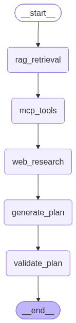

# ✈️ Tripster AI — Agentic Travel Planner

🔗 **Live Demo:** _coming soon_ &nbsp;•&nbsp; 📖 [Full Code Walkthrough](./GUIDE_PROJECT_FLOW.md)

[](https://python.org)
[](https://fastapi.tiangolo.com)
[](https://langchain-ai.github.io/langgraph/)
[](https://ai.google.dev/)
[](https://www.trychroma.com/)
[](https://react.dev)
[](https://modelcontextprotocol.io/)
<a href="https://github.com/Shamik200"></a>

---

## 💡 About

**Tripster** is a full-stack AI travel planner. You fill in a destination, dates, budget and interests — a
**LangGraph agent pipeline** then retrieves destination knowledge from a vector store, pulls flight options
through an **MCP tool**, researches live hotels/activities/weather with **Gemini + Google Search**, and returns a
complete, budget-aware trip plan.

You then **pick** your flight, hotel and day-by-day activities with a live budget tracker, and Gemini writes a
final narrative itinerary, travel tips and a tailored packing list.

---

## 🧠 Core Features

- 🤖 **5-node LangGraph agent** — RAG → MCP tools → web research → plan generation → validation
- 📚 **RAG over travel guides** — ChromaDB indexes your `.txt` guides *and* every past trip for context reuse
- 🛫 **MCP flight tool** — flight options served through a Model Context Protocol server, cached for 1 hour
- 🌍 **Live research** — Gemini 2.5 Flash with Google Search grounding for hotels, activities and weather
- 💸 **Currency-aware budgeting** — prices generated and validated in your chosen currency (USD/EUR/INR/JPY/…)
- 🧾 **Interactive selection UI** — choose flight, hotel and activities with a real-time budget meter
- ✍️ **AI finalization** — narrative summary, day-by-day prose, smart tips and a packing checklist
- 💾 **Zero-setup persistence** — trips saved to JSON + ChromaDB, no external database required

---

## ⚙️ Tech Stack

| Layer            | Technology                                                              |
|------------------|-------------------------------------------------------------------------|
| **Frontend**     | React 18, lucide-react icons, custom dark-theme CSS                      |
| **Backend**      | FastAPI, Uvicorn, Pydantic v2                                            |
| **AI / Agents**  | LangGraph, LangChain, Google Gemini 2.5 Flash (structured output)         |
| **RAG**          | ChromaDB (`travel_guides` + `trip_history` collections)                  |
| **Tools**        | MCP (`FastMCP`) travel server, httpx                                     |
| **Storage**      | JSON file store (`data/trips.json`) + persistent Chroma vectors          |
| **Observability**| Optional LangSmith tracing                                               |

---

## 🔀 Agent Flow



| Node               | What it does                                                            |
|--------------------|--------------------------------------------------------------------------|
| `rag_retrieval`    | Pulls destination knowledge + similar past trips from ChromaDB           |
| `mcp_tools`        | Calls the MCP travel server for flight options (1-hour cache)            |
| `web_research`     | Gemini + Google Search → hotels, activities, weather in the right currency|
| `generate_plan`    | Builds the structured `TripPlan` (itinerary, budget, tips)               |
| `validate_plan`    | Verifies the itinerary day count matches the requested dates             |

Full end-to-end architecture (frontend included): 

---

## 🗂️ Project Structure

```text
Tripster/
├── backend/
│   ├── requirements.txt
│   └── app/
│       ├── main.py                 # FastAPI app + CORS + routers
│       ├── core/config.py          # env loading, paths, cache TTL
│       ├── api/routes/             # health.py, trips.py
│       ├── schemas/trip.py         # Pydantic models (TripPlan, FinalizedPlan, …)
│       ├── services/trip_service.py# planning + finalization orchestration
│       ├── agent/                  # state.py, graph.py, nodes.py, llm.py
│       ├── rag/                    # ingestion.py, retriever.py
│       └── data/                   # database.py, vector_store.py, repositories/
├── frontend/
│   ├── package.json
│   ├── public/index.html
│   └── src/                        # index.js, App.jsx, index.css
├── mcp_servers/travel_server.py    # MCP flight search tool
└── data/
    ├── documents/                  # .txt travel guides used for RAG
    ├── chroma/                     # vector store (auto-created)
    └── trips.json                  # saved trips (auto-created)
```

---

## 🚀 Getting Started

### 📋 Prerequisites

- Python **3.11+**
- Node.js **18+**
- A **Gemini API key** ([get one free](https://aistudio.google.com/app/apikey))

### 1️⃣ Clone & configure

```bash
git clone https://github.com/Shamik200/Tripster.git
cd Tripster

cp .env.example .env
# open .env and set GEMINI_API_KEY=your-key-here
```

### 2️⃣ Backend

```bash
cd backend
python -m venv venv

# Linux / macOS
source venv/bin/activate
# Windows
.\venv\Scripts\Activate.ps1

pip install -r requirements.txt
uvicorn app.main:app --reload --port 8000
```

API is now on **http://localhost:8000** (docs at `/docs`, health at `/health`).

### 3️⃣ Frontend

In a second terminal:

```bash
cd frontend
npm install
npm start
```

Open **http://localhost:3000**, fill the form, and plan a trip 🎉

---

## 🔑 Environment Variables

| Variable                | Required | Description                                        |
|-------------------------|----------|----------------------------------------------------|
| `GEMINI_API_KEY`        | ✅       | Google Gemini API key (research + planning)         |
| `GEMINI_MODEL`          | ➖       | Defaults to `gemini-2.5-flash`                      |
| `LANGCHAIN_TRACING_V2`  | ➖       | `true` to enable LangSmith tracing                  |
| `LANGCHAIN_API_KEY`     | ➖       | LangSmith key when tracing is on                    |
| `LANGCHAIN_PROJECT`     | ➖       | LangSmith project name (default `Tripster`)         |
| `REACT_APP_API_BASE_URL`| ➖       | Frontend → backend URL (default `http://localhost:8000`) |

> Without `GEMINI_API_KEY` the app still runs and returns a deterministic fallback plan — great for a quick smoke test.

---

## 📡 API Reference

| Method | Endpoint            | Description                                            |
|--------|---------------------|--------------------------------------------------------|
| `GET`  | `/health`           | Service health check                                    |
| `POST` | `/api/plan`         | Run the agent pipeline and return a full `TripPlan`     |
| `POST` | `/api/finalize`     | Turn user selections into a finalized AI narrative plan |
| `GET`  | `/api/trips`        | List all saved trips (newest first)                     |
| `GET`  | `/api/trips/{id}`   | Fetch a single saved trip                               |

Example:

```bash
curl -X POST http://localhost:8000/api/plan \
  -H "Content-Type: application/json" \
  -d '{
    "destination": "Tokyo",
    "origin": "Mumbai",
    "budget": 250000,
    "currency": "INR",
    "start_date": "2026-03-10",
    "end_date": "2026-03-15",
    "interests": ["food", "history"],
    "travel_style": "balanced"
  }'
```

---

## 📚 Adding Your Own Travel Knowledge (RAG)

Drop any `.txt` guide into `data/documents/` (examples included: `europe.txt`, `asia.txt`, `usa.txt`,
`general_travel_tips.txt`). They are embedded into the `travel_guides` Chroma collection and retrieved as
destination context during planning. Every generated trip is also indexed into `trip_history`, so future plans
learn from your past ones.

---

## 🧯 Troubleshooting

| Symptom                              | Fix                                                                 |
|--------------------------------------|----------------------------------------------------------------------|
| `500` from `/api/plan`               | Check `GEMINI_API_KEY` in `.env` and the backend terminal traceback  |
| Frontend can't reach the API         | Backend must run on port 8000, or set `REACT_APP_API_BASE_URL`       |
| Prices look like the wrong currency  | Re-run the plan — currency rules are enforced in the planner prompt  |
| Stale flight options                 | Delete `data/mcp_cache.json` (results are cached for 1 hour)         |
| ChromaDB init warning on startup     | Delete `data/chroma/` and restart to rebuild the vector store        |

---

## 📄 License

MIT — free to use, learn from, and build on.

---

<p align="center">Built with ☕ and LangGraph by <a href="https://github.com/Shamik200">Shamik200</a></p>
